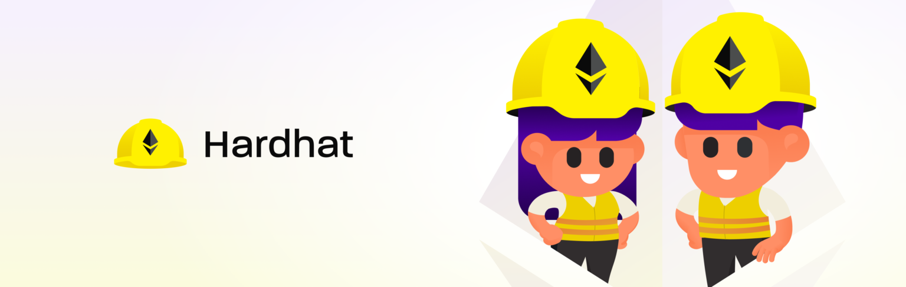

# Hardhat Deep Dive



Hardhat is an essential tool for any aspiring web3 developer. Currently Hardhat is the dominant deployment and testing tool for smart contracts. When learning Hardhat, initial syntax may be a little confusing. Also, Hardhat comes with a lot of functionality under the hood, and given that we are engaging with this through the command line, some of this may be missed or not use to it's fullest.

This deep dive aims to get an intermediate developer comfortable with the syntax of set up and deployment of smart contracts, as well as testing. I do this by working through a lot of examples, gradually adding functionality and complexity as we progress.

# Resources

- [hardhat.org](https://hardhat.org/)
- [node.js](https://nodejs.org/en/)

# Table Of Contents

# Lesson 1 Creating a New Hardhat Project

1. Make a new project folder
2. Create a new node project

```
npm init -y
```

3. Install Hardhat dependencies (this puts all hardhat dependencies in our project)

```
npm install --save-dev hardhat
```

4. Create a new hardhat project (npx executes the command from the local directory)

```
npx hardhat
```

5. Install libraries

```
npm install @openzeppelin/contracts
```

To import openzeppelin contracts in our contract:

```
import "@openzeppelin/contracts/subfolder/contractName.sol";
```

```
	npm install @nomiclabs/hardhat-waffle

			ethereum-waffle


			chai

			@nomiclabs/hardhat-ethers

			ethers
```

6. Create contracts folder. Write or add .sol contract. Compile

```
npx hardhat compile
```

- Initializing a new node.js project
- Installing Hardhat and dependencies
- Creating a new Hardhat project
- Installing essentiall libraries

# Lesson 2: Contracts and Compiling

# Lesson 3: Testing our Contract

# Lesson 4: Deploying our Contract
